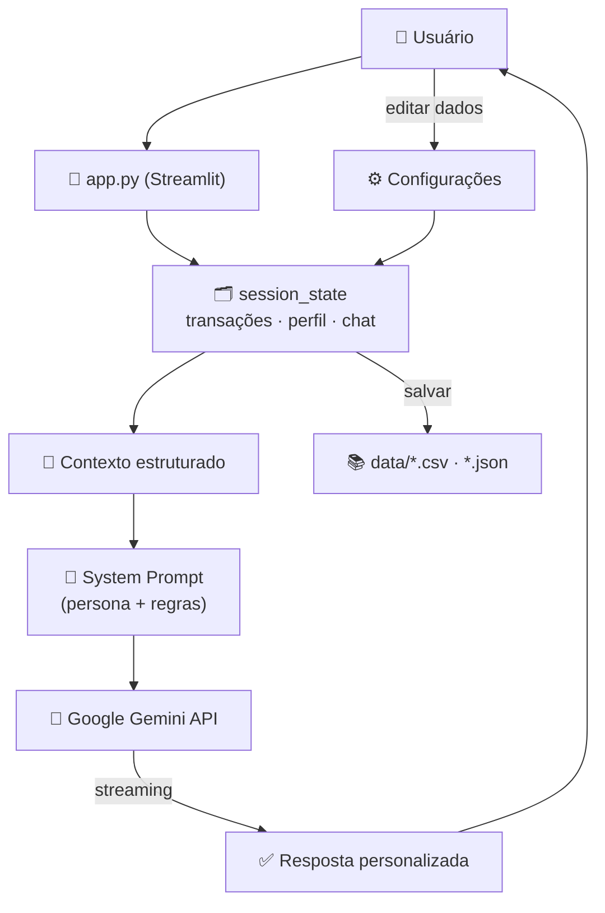

# 💚 Burry — Assistente Financeiro Inteligente

Assistente financeira com IA Generativa que conhece o perfil, as transações e as metas do cliente — e responde de forma **proativa**, **personalizada** e **sem alucinar dados**.

Projeto desenvolvido para o desafio **DIO: Agente Financeiro Inteligente com IA Generativa**.

---

## 📌 Sobre o Projeto

Muitos brasileiros têm dificuldade de entender e controlar suas finanças pessoais. Consultoria financeira humana é cara e os apps bancários tradicionais só respondem quando o cliente pergunta — de forma genérica.

O **Burry** resolve isso: em vez de apenas responder dúvidas, ele **antecipa necessidades** — identifica padrões de gasto, avisa quando o cliente se afasta das metas, sugere produtos financeiros compatíveis com o perfil de risco e explica conceitos financeiros de forma simples e acessível.

---

## ✨ Funcionalidades

- 💬 **Chat consultivo** com IA Generativa (Google Gemini), com respostas em streaming
- 📊 **Resumo financeiro em tempo real** (entradas, saídas e saldo disponível), recalculado a cada interação
- 🎯 **Acompanhamento de metas financeiras** com barra de progresso
- ✏️ **Edição e inserção de dados mockados** diretamente pela interface (transações e perfil do investidor)
- 💾 **Persistência de dados** — alterações feitas no app são salvas de volta nos arquivos `CSV`/`JSON`
- 🛡️ **Sistema anti-alucinação** — o agente só responde com base nos dados fornecidos, e admite quando não sabe algo
- 🤖 **Seleção dinâmica de modelo Gemini**, conforme os modelos disponíveis para a API key informada

---

## 🖥️ Como Funciona

1. O usuário informa o nome e sua própria **Google Gemini API Key** (gratuita).
2. Os dados mockados (`transacoes.csv`, `perfil_investidor.json`, `produtos_financeiros.json`, `historico_atendimento.csv`) são carregados na sessão.
3. Esses dados são transformados em texto estruturado e injetados no **system prompt** do Gemini junto com a persona do Burry e um conjunto de regras de comportamento (few-shot prompting + anti-alucinação).
4. O usuário conversa livremente com o Burry sobre seus gastos, metas e opções de investimento.
5. Alterações feitas no painel de configurações (nova transação, edição de perfil) atualizam o contexto e reiniciam a sessão de chat automaticamente.

### Arquitetura



---

## 🛠️ Tecnologias

| Tecnologia | Uso |
|---|---|
| [Streamlit](https://streamlit.io/) | Interface web do chat |
| [Google Gemini](https://ai.google.dev/) (`google-generativeai`) | Modelo de linguagem (LLM) |
| [Pandas](https://pandas.pydata.org/) | Manipulação dos dados de transações |
| CSV / JSON | Base de dados mockada do cliente |

---

## 🚀 Como Executar

### Pré-requisitos
- Python 3.9+
- Uma **Google Gemini API Key** gratuita — obtenha em [aistudio.google.com/app/apikey](https://aistudio.google.com/app/apikey)

### Instalação

```bash
git clone https://github.com/roze-creator/financial-AI-agent.git
cd financial-AI-agent
pip install streamlit google-generativeai pandas
```

### Executando

```bash
python -m streamlit run src/app.py
```

O app abrirá no navegador. Insira sua API Key na barra lateral para ativar o Burry.

---

## 📁 Estrutura do Projeto

```
financial-AI-agent/
├── src/
│   └── app.py                      # Aplicação Streamlit principal
├── data/
│   ├── transacoes.csv              # Transações do cliente (entradas/saídas)
│   ├── perfil_investidor.json      # Perfil, renda, metas e tolerância a risco
│   ├── produtos_financeiros.json   # Produtos de investimento disponíveis
│   └── historico_atendimento.csv   # Histórico de atendimentos anteriores
├── AGENTS.md                       # Instruções do agente (fonte única de verdade)
├── CLAUDE.md                       # Importa AGENTS.md para uso no Claude Code
└── README.md
```

> Os dados são mockados para o cliente fictício **João Silva**, mas a aplicação foi construída para que qualquer usuário carregue seus próprios dados no mesmo formato.

---

## 🔒 Segurança e Anti-Alucinação

- O agente responde **exclusivamente** com base nos dados fornecidos no contexto — sem busca externa
- Nunca inventa valores, rentabilidades ou saldos
- Admite quando não tem uma informação, em vez de "chutar"
- Toda recomendação de produto menciona o nível de risco e reforça que não substitui uma consultoria certificada
- Não processa dados de outros clientes, não executa transações reais e não acessa a internet

### Limitações declaradas
- Não substitui um consultor financeiro certificado (CFP)
- Não acessa saldos ou dados bancários reais
- Não fornece garantias de rentabilidade

---

## 👤 Desenvolvido por

**Roz** — projeto criado para o desafio DIO *"Agente Financeiro Inteligente com IA Generativa"*.
