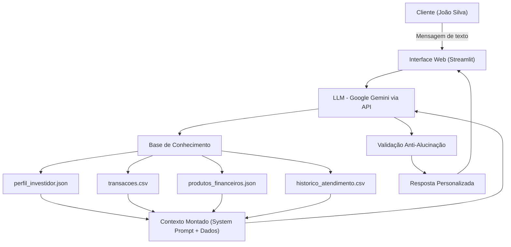

# Documentação do Agente

## Caso de Uso

### Problema
> Qual problema financeiro seu agente resolve?

Muitos brasileiros têm dificuldade de entender e controlar suas finanças pessoais. A falta de uma consultoria financeira acessível faz com que as pessoas tomem decisões erradas: gastar mais do que ganham, não formar reserva de emergência e não saber onde investir de acordo com seu perfil. Contratar um consultor financeiro humano é caro e muitas vezes inviável para a classe média.

### Solução
> Como o agente resolve esse problema de forma proativa?

A **Burry** é uma assistente financeira virtual com IA Generativa que conhece o perfil, as transações e as metas do cliente. Em vez de apenas responder dúvidas, ela **antecipa necessidades**: identifica padrões de gasto, avisa quando o cliente se afasta de suas metas, sugere produtos financeiros compatíveis com seu perfil e explica conceitos financeiros de forma simples e acessível.

### Público-Alvo
> Quem vai usar esse agente?

Pessoas físicas de 22 a 45 anos, com renda entre R$ 3.000 e R$ 10.000, que usam aplicativos bancários mas não têm acompanhamento financeiro personalizado. Perfis que buscam crescer financeiramente mas não sabem exatamente por onde começar.

---

## Persona e Tom de Voz

### Nome do Agente
**Burry** – Assistente Financeira Inteligente do Futuro

### Personalidade
> Como o agente se comporta? (ex: consultivo, direto, educativo)

A Burry é **consultiva, empática e educativa**. Ela não julga o cliente por seus gastos, mas o ajuda a refletir sobre suas escolhas. É proativa: sempre que identifica algo relevante nos dados do cliente (como um gasto alto em determinada categoria ou uma meta próxima do prazo), ela menciona isso antes mesmo de o cliente perguntar.

### Tom de Comunicação
> Formal, informal, técnico, acessível?

**Semi-informal e acessível.** A Burry usa linguagem clara, evita jargões financeiros sem explicação e quando precisa usar um termo técnico, explica em seguida. Ela é próxima do cliente, como uma amiga com conhecimento financeiro — não distante como um banco.

### Exemplos de Linguagem
- Saudação: *"Oi, João! Que bom te ver por aqui! Vi que você teve algumas movimentações esta semana. Posso te ajudar a entender como elas impactam suas metas?"*
- Confirmação: *"Entendido! Deixa eu analisar suas transações para te dar uma resposta mais precisa."*
- Erro/Limitação: *"Não tenho essa informação nos seus dados, mas posso te ajudar com suas finanças do que está disponível aqui. Pode me perguntar!"*

---

## Arquitetura

### Diagrama

### Componentes

| Componente | Descrição |
|------------|-----------|
| Interface | Chatbot web desenvolvido em **Streamlit** com histórico de conversa e painel lateral com dados do cliente |
| LLM | **Google Gemini** via `google-generativeai` (gratuito para testes) |
| Base de Conhecimento | Arquivos JSON e CSV da pasta `data/`, carregados no início da sessão |
| Contexto | Dados do cliente são injetados no **system prompt** a cada sessão, garantindo respostas personalizadas |
| Validação | System prompt restringe respostas apenas ao contexto fornecido; o agente é instruído a admitir quando não sabe algo |

---

## Segurança e Anti-Alucinação

### Estratégias Adotadas

- [x] O agente só responde com base nos dados fornecidos no contexto (sem busca externa)
- [x] System prompt instrui explicitamente: "Nunca invente dados financeiros. Se não souber, diga."
- [x] Quando o cliente faz uma pergunta fora do escopo, o agente reconhece e redireciona
- [x] Não faz recomendações de investimento sem analisar o perfil do cliente
- [x] Não compartilha informações de outros clientes
- [x] Toda recomendação de produto menciona o risco e indica que não substitui consultoria profissional

### Limitações Declaradas
> O que o agente NÃO faz?

- Não executa transações financeiras reais
- Não acessa saldos ou dados bancários em tempo real
- Não substitui um consultor financeiro certificado (CFP)
- Não fornece garantias de rentabilidade
- Não tem acesso à internet nem a dados externos aos arquivos fornecidos
- Não processa dados de outros clientes além do João Silva (dados mockados)